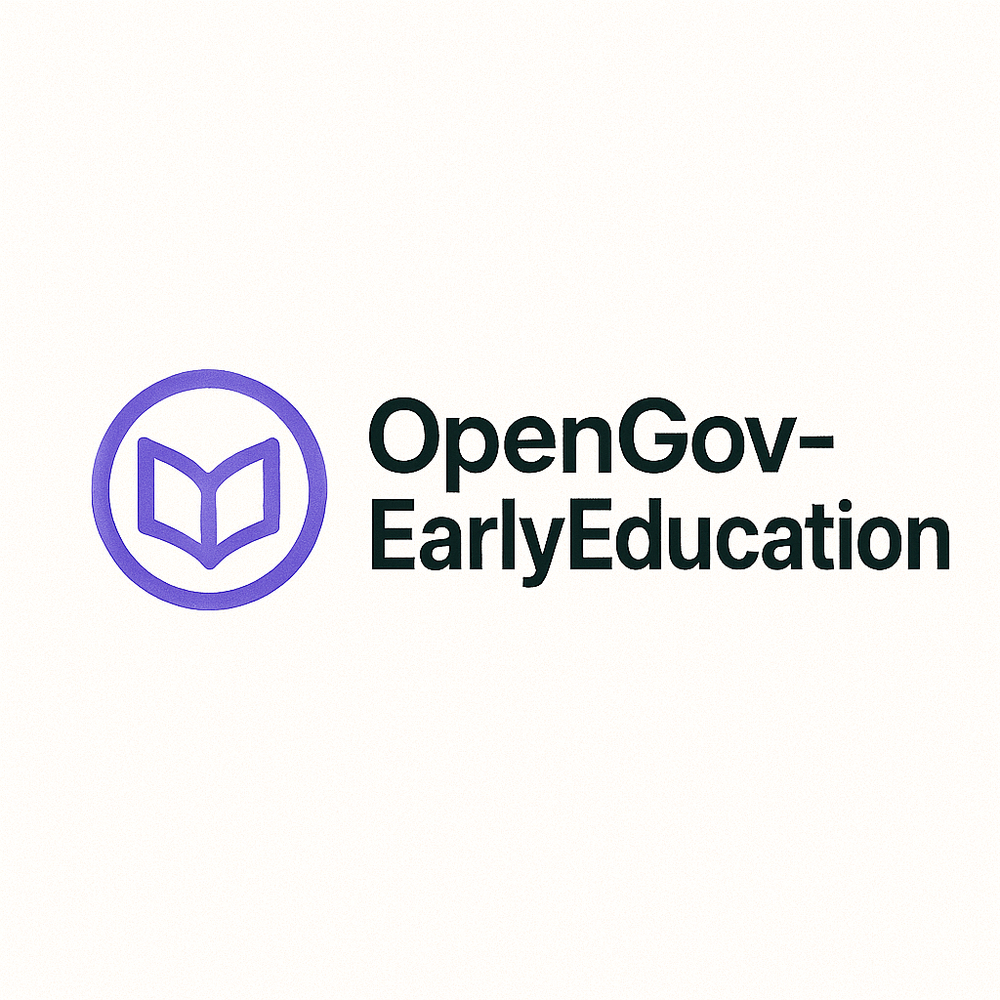

# OpenEarlyEducation



A complete, research-backed early childhood lesson planning and weekly scheduling system that uses AI to generate developmentally appropriate empathy and collaboration-centered curriculum plans.


## Overview

OpenEarlyEducation is a comprehensive early childhood education platform that leverages artificial intelligence to create research-based lesson plans and weekly schedules. The system focuses on:

- **Developmentally Appropriate Practice (DAP)** aligned with NAEYC standards
- **Social-Emotional Learning (SEL)** integration across all activities
- **Play-based, child-centered learning** approaches
- **Universal Design for Learning (UDL)** principles
- **Culturally responsive pedagogy**
- **Authentic assessment and documentation**

## Features

### Core Functionality
- **AI-Powered Lesson Planning**: Generate complete lesson plans using OpenAI's Assistants API
- **Weekly Scheduling**: Create comprehensive weekly schedules with progressive SEL development
- **Assessment Management**: Record and analyze authentic assessments
- **Report Generation**: Export plans as Markdown, PDF, or JSON formats
- **Database Persistence**: SQLite storage with backup and migration support

### User Interfaces
- **Beautiful Terminal UI**: Rich, interactive command-line interface
- **RESTful API**: Complete FastAPI backend for web integration
- **Docker Support**: Containerized deployment ready

### Research Foundations
- **Pedagogical Research**: Based on 15+ research citations including Bowlby, Vygotsky, NAEYC, CASEL
- **Age-Appropriate Sequencing**: Energy-aware activity scheduling
- **Inclusive Design**: UDL principles throughout
- **Family Engagement**: Built-in parent communication strategies

## Requirements

- Python 3.11 or higher
- OpenAI API key
- SQLite (included with Python)

## Installation

### Option 1: Using pip
```bash
# Clone the repository
git clone https://github.com/yourusername/openearlyeducation.git
cd openearlyeducation

# Install dependencies
pip install -r requirements.txt

# Set up environment
export OPENAI_API_KEY="your-openai-api-key-here"
```

### Option 2: Using Docker
```bash
# Clone the repository
git clone https://github.com/yourusername/openearlyeducation.git
cd openearlyeducation

# Build and run with Docker Compose
docker-compose up --build
```

### Option 3: Development Setup
```bash
# Clone the repository
git clone https://github.com/yourusername/openearlyeducation.git
cd openearlyeducation

# Create virtual environment
python -m venv venv
source venv/bin/activate  # On Windows: venv\\Scripts\\activate

# Install in development mode
pip install -e .
pip install -r requirements.txt
```

## Usage

### Terminal User Interface (TUI)

Launch the beautiful terminal interface:
```bash
python -m src.main tui
```

Navigate using arrow keys and press Enter to select options. The TUI provides:
- Interactive lesson plan generation
- Assessment recording and progress tracking
- Report generation and export
- Database management tools

### Command Line Interface

Generate a lesson plan:
```bash
python -m src.main day --date 2025-01-15 --age-group 3-4 --theme "Friendship and Sharing"
```

Generate a weekly schedule:
```bash
python -m src.main week --start-date 2025-01-13 --age-group 4-5 --theme "Community Helpers"
```

Record an assessment:
```bash
python -m src.main assess --child-id A123 --domain social_emotional --observation "Shared toys with peers"
```

Generate a progress report:
```bash
python -m src.main report --child-id A123 --start 2024-12-01 --end 2024-12-31
```

### Web API

Start the FastAPI server:
```bash
python -m src.main api --port 8000
```

Then visit http://localhost:8000/docs for interactive API documentation.

Example API calls:
```bash
# Generate lesson plan
curl -X POST "http://localhost:8000/lesson-plans" \
     -H "Content-Type: application/json" \
     -d '{
       "date": "2025-01-15",
       "age_group": "3-4",
       "theme": "Friendship and Sharing",
       "duration_minutes": 360
     }'

# Get all lesson plans
curl "http://localhost:8000/lesson-plans"

# Export lesson plan as PDF
curl "http://localhost:8000/export/lesson-plan/{plan_id}/pdf"
```

## API Documentation

The FastAPI server provides comprehensive REST endpoints:

### Lesson Plans
- `POST /lesson-plans` - Generate a new lesson plan
- `GET /lesson-plans` - List lesson plans with filtering
- `GET /lesson-plans/{plan_id}` - Get specific lesson plan

### Weekly Schedules
- `POST /weekly-schedules` - Generate a weekly schedule
- `GET /weekly-schedules` - List weekly schedules
- `GET /weekly-schedules/{schedule_id}` - Get specific schedule

### Assessments
- `POST /assessments` - Record an assessment observation
- `GET /assessments/{child_id}` - Get child's assessment history

### Reports
- `POST /progress-reports` - Generate progress report
- `GET /export/lesson-plan/{plan_id}/markdown` - Export lesson plan as Markdown
- `GET /export/weekly-schedule/{schedule_id}/pdf` - Export schedule as PDF

## Database Management

The system uses SQLite for data persistence with the following features:

- **Automatic migrations** on startup
- **Backup functionality** via API or CLI
- **Data integrity** with foreign keys and constraints
- **Audit logging** for all database operations
- **Cleanup utilities** for old records

Database statistics are available at `/database/statistics`.

## Testing

Comprehensive test suite included:

```bash
# Run all tests
pytest

# Run with coverage
pytest --cov=src

# Run specific test types
pytest tests/test_models.py          # Unit tests
pytest tests/test_integration.py     # Integration tests
pytest tests/test_database.py        # Database tests

# Run tests in Docker
docker-compose exec app pytest
```

## Architecture

```
src/
├── core/                 # Core business logic
│   ├── config.py        # Configuration management
│   ├── database.py      # SQLite database manager
│   ├── models.py        # Pydantic models and validation
│   ├── assistant.py     # OpenAI Assistant integration
│   ├── engine.py        # Curriculum generation engine
│   ├── reports.py       # Report generation
│   └── assessment.py    # Assessment service
├── tui/                 # Terminal user interface
│   └── app.py          # Rich-based TUI application
├── api/                 # FastAPI web application
│   └── app.py          # REST API endpoints
└── main.py             # Main application entry point

tests/                   # Comprehensive test suite
├── test_models.py      # Model validation tests
├── test_database.py    # Database operation tests
└── test_integration.py # Integration tests
```

## Research Foundations

This system is built on extensive research in early childhood education:

### Key References
- **Bowlby, J. (1969)** - Attachment and Loss: Vol. 1. Attachment
- **Copple & Bredekamp (2009)** - Developmentally Appropriate Practice
- **Durlak et al. (2011)** - Social and Emotional Learning meta-analysis
- **Hirsh-Pasek et al. (2009)** - Playful Learning in Preschool
- **Johnson & Johnson (1999)** - Cooperative Learning
- **NAEYC (2020)** - Developmentally Appropriate Practice Position Statement
- **Vygotsky (1978)** - Mind in Society
- **CAST (2018)** - Universal Design for Learning Guidelines
- **CASEL (2020)** - SEL Framework

### Pedagogical Principles
1. **Nurturing Relationships** - Secure attachment and emotional safety
2. **Developmentally Appropriate Practice** - Age and individually appropriate activities
3. **Play-Based Learning** - Child-centered, hands-on experiences
4. **Social-Emotional Integration** - SEL across all domains and routines
5. **Inclusive Design** - Universal Design for Learning principles
6. **Cultural Responsiveness** - Respectful of all families and cultures
7. **Authentic Assessment** - Strengths-based, observational assessment

## Contributing

We welcome contributions! Please see our [Contributing Guide](CONTRIBUTING.md) for details.

### Development Setup
1. Fork the repository
2. Create a feature branch
3. Make your changes with comprehensive tests
4. Ensure all tests pass
5. Submit a pull request

## License

This project is licensed under the MIT License - see the [LICENSE](LICENSE) file for details.

## Acknowledgments

- **Early Childhood Educators** who provided valuable feedback and insights
- **OpenAI** for providing the Assistants API
- **Research Community** for the foundational studies that guide this work
- **NAEYC and CASEL** for their leadership in early childhood education

## Support

- **Documentation**: [Full API Documentation](http://localhost:8000/docs)
- **Issues**: [GitHub Issues](https://github.com/yourusername/openearlyeducation/issues)
- **Discussions**: [GitHub Discussions](https://github.com/yourusername/openearlyeducation/discussions)

---

**Author**: Nik Jois <nikjois@llamasearch.ai>
**Version**: 2.0.0
**Last Updated**: 2025-01-15
